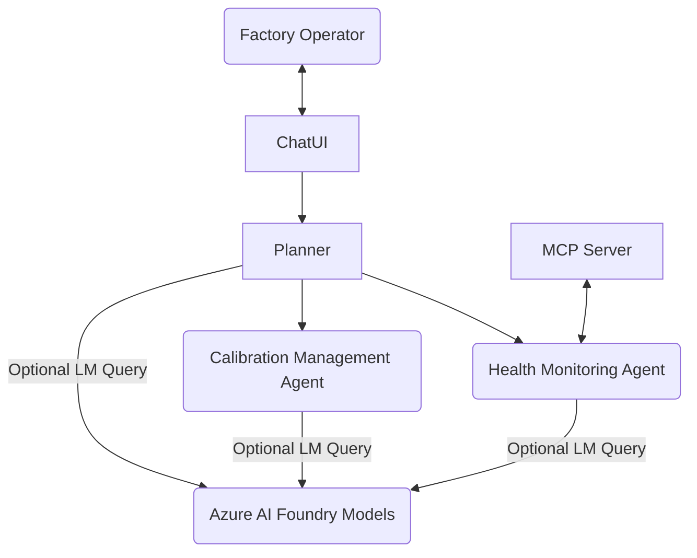

# RAGA - Robotic Arm Gripper Agents
**Human-in-the-Loop, AI-Augmented Factory Robotics Agents**

---

## Problem Formulation

Modern factory floors increasingly rely on robotic arms for precision tasks such as assembly, welding, and material handling. However, operational challenges arise:

- **End effector misalignments** causing defective operations or quality issues,
- **Calibration drift** due to environmental conditions, payload changes, mechanical wear,
- **Cognitive overload** on human operators monitoring complex telemetry,
- **Risk of incorrect recalibrations** without thorough diagnosis and human validation.

> **Problem Statement:**  
> How to augment a factory operator with intelligent agents that monitor, reason about, and recommend corrective actions — improving efficiency, safety, and resilience while preserving human authority over final decisions.

---

## Hypotheses and Experiments 
This project follows a **Hypothesis-Driven Development (HDD)** approach. Each phase is structured as an experiment to validate specific hypotheses.

---

### Hypothesis 1: Telemetry Ingestion Enables Accurate Pose Deviation Detection
> **Real-time telemetry ingestion through an Model Context Protocol (MCP) Server enables accurate detection of robotic arm pose deviations and gripper misalignments.**

**Experiment 1:**
- Build an MCP Server emitting simulated robotic telemetry (joint angles, forces, end effector pose).
- Health Monitoring Agent ingests and processes telemetry streams.

**Expected Outcomes:**
- 90% correct detection rate for pose deviations greater than 2mm/2°.
- Schema mapping succeeds without data loss.

---

### Hypothesis 2: Cognitive Augmentation Improves Diagnostic and Planning Quality
> **Azure AI Foundry-hosted LLMs augment agent reasoning, improving misalignment diagnosis and recalibration planning.**

**Experiment 2:**
- Agents selectively call LLM endpoints for diagnostics and plan suggestions.
- Compare baseline rule-based vs LLM-augmented agent outputs.

**Expected Outcomes:**
- 15–30% improvement in diagnosis accuracy.
- Model query turnaround within 3 seconds.
- Human Supervisor preference for LLM-augmented responses in >80% of test cases.

---

### Hypothesis 3: Agent-to-Agent Coordination Enables Dynamic Calibration Workflow
> **Structured Agent-to-Agent (A2A) messaging enables dynamic task delegation and collaboration.**

**Experiment 3:**
- Implement A2A protocol messaging between Health Monitoring and Calibration Manager Agents.
- Simulate multiple simultaneous pose deviation events.

**Expected Outcomes:**
- Agents dynamically delegate tasks and propose coordinated calibration plans.
- No direct synchronous function calling between agents — only message passing.
- Instrumentation of Agent-Agent Communication to enable diagnosis and recovery.

---

## Simulation Assumptions

The RAGA MCP Server simulates robotic telemetry streams to validate agent ingestion and reasoning workflows (not connecting to physical robots).

To balance realism and simplicity:
- **Pose deviation and gripper misalignment** are simulated based on common robotic tolerance thresholds (e.g., UR, KUKA, ABB standards).
- **Gaussian noise** is injected into force, torque, and pose telemetry to mimic sensor imperfections.
- **Telemetry update frequency** is simplified to slow intervals (1 event every 2–5 seconds) for Phase 1, with future work to support higher sampling rates (~10–100Hz).

> See [Simulation Assumptions](docs/simulation_assumptions.md) for details.

---

### Example: Human-in-the-Loop  Workflow

**Scenario:**
A factory operator wants to check and correct the status of a robotic arm in Warehouse 7.

**Operator:**
> Check the status of the robotic arm in warehouse 7.

**Agent Planner:**
> The latest telemetry indicates the end effector is misaligned (pose deviation detected). Would you like me to propose a new configuration?

**Operator:**
> Yes, fix it.

**Agent Planner:**
> Proposing new configuration... Calibration plan ready. Would you like to apply this configuration?

**Operator:**
> Yes, apply it.

**Agent Planner:**
> Configuration applied. The robotic arm in warehouse 7 is now aligned and operational. Would you like a summary report?

**Operator:**
> No, thank you.

**Agent Planner:**
> Acknowledged. Monitoring will continue. Let me know if you need further assistance.

This workflow demonstrates:
- Real-time telemetry ingestion and analysis
- Human-in-the-loop validation for critical actions
- Agent-driven diagnosis, planning, and execution
- Auditable operator-agent communication

---

## System Architecture

RAGA is structured as a modular, multi-agent system with human-in-the-loop validation.

- **Operations Coordinator (aka Planner)**: Receives goals or events, decides which agent(s) to activate, manages task decomposition, skill selection, reasoning flow.
- **Health Monitoring Agent**: Monitors telemetry for gripper misalignments.
- **MCP Server**: Emits robotic telemetry (joint states, force readings, end effector pose).
- **Calibration Management Agent**: Plans recalibration strategies based on alerts.
- **Azure AI Foundry-hosted LMs**: Language models Provide cognitive reasoning assistance when required.
- **Chat UI**: Human Supervisor reviews alerts, queries agents, and confirms actions.
- **A2A Messaging**: Structured REST API messages handle agent-agent collaboration.


---
## Quick Links

- [System Components](docs/system_components.md)
- [Experiments and Expected Outcomes](docs/capability_evolution.md)
- [Deployment Plan](docs/deployment_plan.md)
- [Simulation Assumptions](docs/simulation_assumptions.md)
---

## Using This Sample

### Prerequisites
- Docker (and Kubernetes)
- Python 3.10+ (for CLI utilities)
- (Optional) Azure credentials for AI Foundry model queries

### Steps

**1. Clone the Repository**
```bash
git clone https://github.com/<your-org>/raga.git
cd raga
```

---

## Usage


1. Start the MCP Server (simulated or real telemetry)
2. Deploy the Health Monitoring Agent, Calibration Management Agent, and Planner
3. Use the Chat UI (CLI or web) to interact as a factory operator
