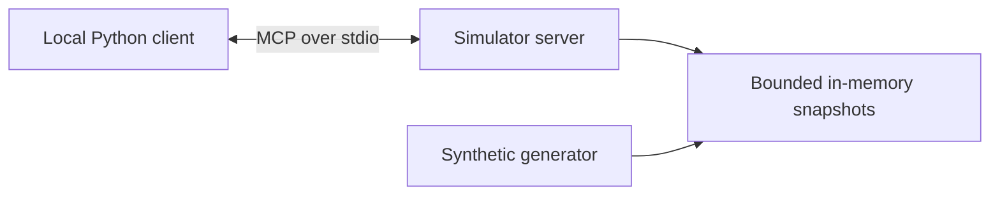

# RAGA — Robotic Arm Gripper Agents

A local MCP telemetry simulator for exploring evidence-based assistance to robot operators.

**Status (2026-09-11): early prototype; Phase 1 is partial.** RAGA generates synthetic robot snapshots and exposes them through MCP resources and tools. It does not detect misalignment, diagnose faults, control a robot, or implement human approval. None of the research hypotheses below has been validated.

## Run the local demo

Requires Python 3.10+ and [uv](https://docs.astral.sh/uv/getting-started/installation/). No Docker, Kubernetes, Azure account, model key, or robot is required.

```bash
git clone https://github.com/niksacdev/raga.git
cd raga
uv sync --locked
uv run --locked python main.py
uv run --locked pytest -q
uv run --locked pip-audit
```

The demo starts a simulator subprocess over **stdio**, reads a synthetic snapshot, changes its X coordinate in memory, lists cached robots, prints a simulation-only prompt, and exits. State is discarded when the process exits. No network listener or model call is started. First-time dependency installation requires network access.

To attach an MCP-compatible host, configure its command as `uv`, arguments as `run --locked python -m src.mcp_server.genericrobotserver`, and working directory as your RAGA checkout. Tools change simulated state without an approval step; approval enforcement is future work. The host may send resource/tool contents to its model provider: use synthetic identifiers and data only.

## What is implemented

| Capability | Status and evidence |
| --- | --- |
| Synthetic six-joint telemetry | Implemented in `src/mcp_server/simulator.py`; no kinematics or reference pose |
| MCP resources, tools and prompt | Implemented in `src/mcp_server/genericrobotserver.py`; on-demand cached snapshots, not streaming |
| Client/server round trip | Implemented in `src/mcp_client/client.py`; SDK stdio lifecycle and demo |
| Validated, atomic simulated updates | Implemented; invalid updates preserve state, IDs and cache size are bounded |
| Regression checks | `tests/test_simulator.py`, `tests/test_mcp_integration.py`; protocol and state invariants |
| Deviation detector and monitoring agent | **Planned**; random status labels are not diagnostic predictions |
| LLM diagnosis, calibration planner, supervisor UI | **Planned**; no model integration or approval/audit workflow |
| A2A, ROS 2, real robots, deployment manifests | **Planned**; no implementation |

The original implementation dates to April–May 2025. The September 2026 update repairs runtime and data-integrity issues and aligns documentation; it does not complete the proposed agent phases.

## Problem and hypotheses

Operators need to distinguish sensor noise, fixture problems and calibration drift before deciding on an intervention. RAGA's proposed contribution is a small, auditable diagnostic assistant grounded in telemetry and maintenance evidence. It is not a robot foundation model or a safety controller.

1. **Telemetry and detection:** can a deterministic detector identify deviations against a reference pose? The original target was at least 90% detection above 2 mm / 2°. This remains an untested experimental target, not an OEM tolerance or achieved result. Establish labeled fixtures, false-alarm limits and frame conventions first.
2. **Diagnostic assistance:** does an LLM improve operator diagnosis over the same evidence and rules? The original 15–30% accuracy improvement, under-3-second response, and over-80% operator preference are untested targets. Define relative versus absolute improvement and measure harmful recommendations, abstention, cost and latency before claiming benefit.
3. **Coordination:** does A2A improve a real multi-owner workflow over a single process? No messaging or experiment exists. Introduce it only after simpler orchestration has a measured limitation.

The [roadmap](docs/capability_evolution.md) defines the experiments and gates. The [market assessment](docs/market_assessment_2026-09.md) separates public evidence from the proposed value proposition: general robotics intelligence is increasingly supplied by major platforms; a focused, independently evaluated operator workflow is still a hypothesis worth testing.

## Architecture today



See [system components](docs/system_components.md), [simulation assumptions](docs/simulation_assumptions.md), and [deployment plan](docs/deployment_plan.md) for boundaries and future work.

## Public repository and security

Use only synthetic data. This sample has no authentication, tenant isolation, durable audit trail or hardware safety system. IDs are lookup keys, not access permissions. Do not expose it as a network service or connect actuators. Review [SECURITY.md](SECURITY.md) and the [dated audit](docs/security_review_2026-09.md) before extending it.

The project uses the maintained MCP Python SDK 1.x API with a `<2` bound; SDK 2.x migration is separate work. `uv.lock` is the reproducibility source. Dependabot checks Python, Actions and devcontainer dependencies; CI checks the supported Python floor and a newer interpreter.
